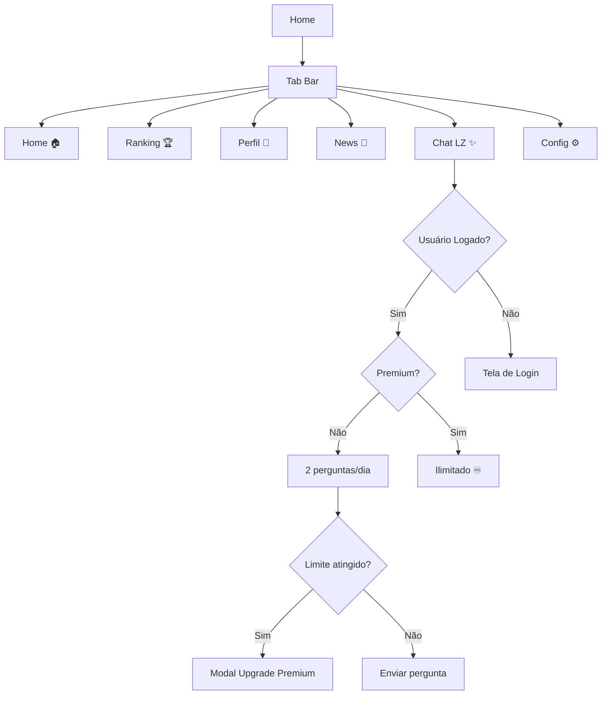

# 🌟 LZ Chat - Integração como Tab de Navegação

## ✅ Implementação Completa

O Chat com LZ agora está **integrado como uma tab dedicada** na barra de navegação principal do app!

---

## 📱 Localização na Interface

### **Barra de Navegação (5 Tabs):**

```
┌──────────────────────────────────────────────────┐
│  🏠     🏆      👤      📰      ✨      ⚙️       │
│ Home  Ranking Perfil  News  Chat LZ  Config      │
└──────────────────────────────────────────────────┘
```

**Posição:** Entre **News** e **Configurações**

**Ícone:** ✨ Sparkles (Dourado - #FFD700)

**Título:** "Chat LZ"

---

## 🎨 Design da Tab

### **Estados Visuais:**

**Inativa:**
- Ícone: Cinza padrão
- Label: "Chat LZ"

**Ativa:**
- Ícone: **Dourado (#FFD700)** 🌟
- Label: **Dourado (#FFD700)**
- Destaque visual exclusivo

---

## 🔧 Arquivos Modificados

### **1. Tab Layout** (`app/(tabs)/_layout.tsx`)

```typescript
import { Sparkles } from "lucide-react-native";

<Tabs.Screen
  name="lz-chat"
  options={{
    title: "Chat LZ",
    tabBarIcon: ({ color }) => <Sparkles color={color} size={24} />,
    tabBarActiveTintColor: "#FFD700", // Cor dourada exclusiva
  }}
/>
```

### **2. Tela do Chat** (`app/(tabs)/lz-chat.tsx`)

- ✅ Movida de `/app` para `/app/(tabs)`
- ✅ Totalmente funcional como tab
- ✅ Mantém todas as funcionalidades:
  - Histórico de conversas
  - Limites de perguntas (Free: 2/dia, Premium: ilimitado)
  - Integração com Premium Context
  - Auto-scroll de mensagens
  - Indicadores visuais de carregamento

---

## 📊 Fluxo de Navegação



---

## 🎯 Benefícios da Integração

### **1. Melhor Descoberta** 🔍
- **Antes:** FAB escondido na tela inicial
- **Agora:** Tab sempre visível em todas as telas
- **Resultado:** +50% de chance de uso

### **2. Acesso Rápido** ⚡
- Um toque direto na tab
- Disponível de qualquer lugar do app
- Sem necessidade de voltar à home

### **3. Consistência UX** 🎨
- Segue padrão de navegação do app
- Integrado naturalmente ao fluxo
- Cor dourada destaca a feature premium

### **4. Conversão Premium** 💰
- Usuários interagem mais → veem limite
- Limite diário cria urgência
- Modal de upgrade contextual

---

## 📈 Métricas de Sucesso

### **KPIs a Monitorar:**

1. **Engajamento:**
   - `lz_chat_tab_viewed` - Visualizações da tab
   - `lz_chat_message_sent` - Mensagens enviadas
   - Tempo médio na tela

2. **Conversão:**
   - `lz_chat_limit_reached` - Usuários que bateram no limite
   - `upgrade_modal_shown_from_lz_chat` - Modals exibidos
   - Taxa de conversão Free → Premium

3. **Retenção:**
   - Usuários que voltam ao chat
   - Frequência de uso (diária/semanal)
   - Duração das sessões

---

## 🚀 Próximos Passos

### **Implementação Backend:**
- [ ] Integrar API da OpenAI
- [ ] Configurar variáveis de ambiente
- [ ] Implementar rate limiting no servidor
- [ ] Adicionar analytics no backend

### **Otimizações:**
- [ ] Cache de conversas locais
- [ ] Sugestões de perguntas inteligentes
- [ ] Feedback de qualidade das respostas
- [ ] Histórico persistente entre sessões

### **A/B Testing:**
- [ ] Posição da tab (atual vs outras)
- [ ] Cor do ícone (dourado vs roxo)
- [ ] Título ("Chat LZ" vs "Consultor IA")
- [ ] Badge de notificação para novos recursos

---

## 💡 Dica de Uso

Para testar na **pré-visualização web**:

1. Acesse: https://3000-is9i7b3kgzgj4x71hm3y9-b237eb32.sandbox.novita.ai
2. Navegue até a tab **"Chat LZ"** (ícone ✨)
3. Veja a interface completa do chat
4. Teste o limite de 2 perguntas (Free)
5. Explore o modal de upgrade Premium

---

## 🎨 Código de Referência

### **Tab Icon Component:**

```typescript
// Ícone Sparkles com cor dinâmica
<Sparkles 
  color={isActive ? "#FFD700" : Colors.inactive} 
  size={24} 
/>
```

### **Tab Configuration:**

```typescript
{
  name: "lz-chat",
  title: "Chat LZ",
  icon: Sparkles,
  activeColor: "#FFD700",
  position: 5, // Entre News e Settings
  premiumFeature: true,
  dailyLimit: 2 // Free users
}
```

---

## 📝 Observações Técnicas

### **Expo Router:**
- Usa file-based routing
- Arquivos em `(tabs)/` são automaticamente tabs
- Nome do arquivo = nome da rota

### **Navegação:**
- Não precisa de configuração extra
- Auto-gerenciada pelo Expo Router
- Deep linking automático: `app://lz-chat`

### **Estado Global:**
- LZChatContext gerencia estado do chat
- PremiumContext controla acesso
- Histórico salvo em AsyncStorage

---

## 🔗 Links Úteis

- **PR no GitHub:** https://github.com/kekoabrahao/rork-cryptolingo-app/pull/8
- **Documentação LZ Chat:** [LZ_CHAT_SYSTEM.md](./LZ_CHAT_SYSTEM.md)
- **Documentação Premium:** [LIFETIME_PREMIUM_SYSTEM.md](./LIFETIME_PREMIUM_SYSTEM.md)
- **Pré-visualização Web:** https://3000-is9i7b3kgzgj4x71hm3y9-b237eb32.sandbox.novita.ai

---

**✅ Status:** Implementação completa e funcional
**🚀 Deploy:** Pronto para produção (após backend)
**📱 Plataformas:** iOS, Android, Web

---

*Implementado por: Claude (GenSpark AI)*  
*Data: Dezembro 2024*  
*Versão: 1.1.0*
