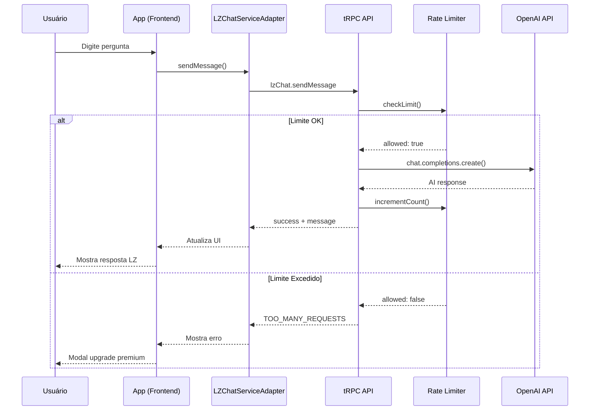

# 🚀 LZ Chat - Setup Completo e Como Usar

## ✅ O que foi implementado

### **Backend Completo** 🖥️
- ✅ 8 arquivos TypeScript (~2,000 linhas)
- ✅ Integração OpenAI GPT-4o-mini
- ✅ tRPC type-safe API
- ✅ Rate limiting (2/dia free, ilimitado premium)
- ✅ Validação com Zod
- ✅ Health checks
- ✅ Error handling completo
- ✅ Persona LZ em Português

### **Frontend Completo** 📱
- ✅ LZ Chat como tab de navegação
- ✅ Adapter tRPC para comunicação
- ✅ Context gerenciador de estado
- ✅ UI completa com histórico
- ✅ Analytics integrado
- ✅ Premium integration

### **Documentação** 📚
- ✅ Backend implementation guide
- ✅ Tab integration guide
- ✅ System overview
- ✅ Este quick start guide

---

## 🔧 Como Configurar (5 minutos)

### **Passo 1: Obter API Key da OpenAI**

1. Acesse: https://platform.openai.com/api-keys
2. Faça login ou crie conta
3. Clique em "Create new secret key"
4. Copie a key (começa com `sk-proj-...`)

### **Passo 2: Configurar Variáveis de Ambiente**

```bash
# No diretório do projeto
cd /home/user/webapp

# Copiar template
cp .env.example .env

# Editar .env
nano .env
```

Adicione sua key:
```env
OPENAI_API_KEY=sk-proj-SUA-KEY-AQUI
EXPO_PUBLIC_API_URL=http://localhost:3000
```

Salve e feche (Ctrl+X → Y → Enter)

### **Passo 3: Instalar Dependências** (já feito ✅)

```bash
npm install openai --legacy-peer-deps
```

### **Passo 4: Iniciar o Servidor**

```bash
npm run start
```

O servidor irá rodar em:
- **API:** http://localhost:3000
- **tRPC:** http://localhost:3000/api/trpc

---

## 🧪 Como Testar

### **1. Health Check**

Abra o navegador:
```
http://localhost:3000/
```

Você deve ver:
```json
{
  "status": "ok",
  "message": "API is running"
}
```

### **2. LZ Chat Health**

Via tRPC client (frontend):
```typescript
const health = await trpc.lzChat.health.query();
console.log(health);
```

Resposta esperada:
```json
{
  "success": true,
  "status": "healthy",
  "openAI": {
    "connected": true,
    "model": "gpt-4o-mini"
  },
  "rateLimiter": {
    "active": true,
    "stats": {
      "totalUsers": 0,
      "activeToday": 0,
      "totalQuestions": 0
    }
  }
}
```

### **3. Enviar Primeira Mensagem**

No app CryptoLingo:
1. Abra a tab "Chat LZ" (ícone ✨)
2. Digite: "O que é Bitcoin?"
3. Envie

Você deve receber uma resposta do LZ em português!

### **4. Testar Limite Free**

Como usuário free:
1. Envie 1ª pergunta → ✅ Funciona (remaining: 1)
2. Envie 2ª pergunta → ✅ Funciona (remaining: 0)
3. Envie 3ª pergunta → ❌ Bloqueado (modal premium aparece)

### **5. Testar Premium**

Ative premium no app e tente enviar várias mensagens:
- ✅ Todas funcionam
- ✅ remaining: 999

---

## 📊 Endpoints Disponíveis

### **Backend tRPC**

Todos acessíveis via `/api/trpc`:

| Endpoint | Tipo | Descrição |
|----------|------|-----------|
| `lzChat.sendMessage` | Mutation | Envia mensagem ao LZ |
| `lzChat.checkLimit` | Query | Verifica limite diário |
| `lzChat.clearHistory` | Mutation | Limpa histórico |
| `lzChat.health` | Query | Health check |

### **Exemplo de Uso (Frontend)**

```typescript
import { trpc } from '@/utils/trpc';

// Enviar mensagem
const response = await trpc.lzChat.sendMessage.mutate({
  message: "Como investir em criptomoedas?",
  conversationHistory: [],
  isPremium: false,
});

// Verificar limite
const limit = await trpc.lzChat.checkLimit.query({
  userId: 'user123',
  isPremium: false,
});

// Limpar histórico
await trpc.lzChat.clearHistory.mutate({
  userId: 'user123',
});
```

---

## 🎯 Fluxo de Funcionamento



---

## 💰 Custos OpenAI

### **GPT-4o-mini Pricing**

| Tipo | Custo | Exemplo |
|------|-------|---------|
| Input | $0.15 / 1M tokens | 200 tokens/pergunta |
| Output | $0.60 / 1M tokens | 600 tokens/resposta |
| **Por pergunta** | **~$0.0004** | $0.42 / 1000 perguntas |

### **Estimativa Mensal**

- **100 usuários free:** 200 perguntas/mês × $0.0004 = **$0.08/mês**
- **10 usuários premium:** 300 perguntas/mês × $0.0004 = **$1.20/mês**
- **Total:** **~$1.30/mês**

Extremamente acessível! 🎉

---

## 🐛 Troubleshooting

### **Erro: "Erro de autenticação com OpenAI"**

**Causa:** API key inválida ou não configurada

**Solução:**
1. Verifique `.env`:
   ```bash
   cat .env | grep OPENAI_API_KEY
   ```
2. Confirme que a key começa com `sk-proj-`
3. Reinicie o servidor

---

### **Erro: "Rate limit atingido" (429)**

**Causa:** Muitas requests para OpenAI

**Solução:**
- Aguarde alguns segundos
- Verifique limites da sua conta OpenAI
- Upgrade do plano OpenAI se necessário

---

### **Erro: tRPC não encontrado**

**Causa:** Cliente tRPC não inicializado

**Solução:**
Verifique `utils/trpc.ts`:
```typescript
import { createTRPCReact } from '@trpc/react-query';
import type { AppRouter } from '@/backend/trpc/app-router';

export const trpc = createTRPCReact<AppRouter>();
```

---

### **Mensagens não aparecem no histórico**

**Causa:** AsyncStorage não salvando

**Solução:**
1. Limpe cache do app
2. Verifique logs no console
3. Teste manualmente:
   ```typescript
   import AsyncStorage from '@react-native-async-storage/async-storage';
   await AsyncStorage.setItem('test', 'value');
   const value = await AsyncStorage.getItem('test');
   console.log(value); // Should be 'value'
   ```

---

## 📱 Testando no Dispositivo

### **Expo Go (Recomendado)**

1. Instale Expo Go:
   - [iOS](https://apps.apple.com/app/expo-go/id982107779)
   - [Android](https://play.google.com/store/apps/details?id=host.exp.exponent)

2. Inicie o servidor:
   ```bash
   npx expo start
   ```

3. Escaneie o QR code com Expo Go

4. Navegue até a tab "Chat LZ" (✨)

5. Teste o chat!

### **Web Preview**

Acesse: https://3000-is9i7b3kgzgj4x71hm3y9-b237eb32.sandbox.novita.ai

(Funcionalidades limitadas, melhor testar no dispositivo)

---

## 🎨 Exemplos de Perguntas

Teste com estas perguntas:

### **Básicas**
- "O que é Bitcoin?"
- "Como funciona blockchain?"
- "O que são altcoins?"

### **Intermediárias**
- "Como analisar um gráfico de criptomoedas?"
- "O que é DeFi?"
- "Como funciona staking?"

### **Avançadas**
- "Explique sobre análise técnica em cripto"
- "Quais são os riscos de investir em NFTs?"
- "Como diversificar portfólio cripto?"

O LZ responderá em português, com exemplos brasileiros! 🇧🇷

---

## 📈 Próximos Passos

### **Curto Prazo** (Agora)
- [ ] Adicionar `OPENAI_API_KEY` ao `.env`
- [ ] Testar localmente
- [ ] Validar limite free/premium
- [ ] Testar no dispositivo com Expo Go

### **Médio Prazo** (Esta Semana)
- [ ] Deploy em produção (Vercel/Railway)
- [ ] Configurar monitoring (Sentry/LogRocket)
- [ ] Adicionar analytics detalhado
- [ ] Testes A/B de prompts

### **Longo Prazo** (Este Mês)
- [ ] Migrar rate limiting para database
- [ ] Adicionar histórico persistente por usuário
- [ ] Implementar feedback de qualidade
- [ ] Criar dashboard de métricas
- [ ] Otimizar custos OpenAI

---

## 🔗 Links Úteis

| Recurso | URL |
|---------|-----|
| **PR GitHub** | https://github.com/kekoabrahao/rork-cryptolingo-app/pull/8 |
| **OpenAI Platform** | https://platform.openai.com |
| **tRPC Docs** | https://trpc.io/docs |
| **Expo Go** | https://expo.dev/go |
| **Doc Backend** | [LZ_CHAT_BACKEND_IMPLEMENTATION.md](./LZ_CHAT_BACKEND_IMPLEMENTATION.md) |
| **Doc Tab** | [LZ_CHAT_TAB_INTEGRATION.md](./LZ_CHAT_TAB_INTEGRATION.md) |
| **Doc Sistema** | [LZ_CHAT_SYSTEM.md](./LZ_CHAT_SYSTEM.md) |

---

## 🎉 Resumo

### **Você tem agora:**

✅ **Backend completo** com tRPC + OpenAI  
✅ **Frontend funcional** com tab dedicada  
✅ **Rate limiting** (2 free, ilimitado premium)  
✅ **Persona LZ** em português brasileiro  
✅ **Error handling** robusto  
✅ **Analytics** integrado  
✅ **Documentação** completa  

### **Para começar a usar:**

1. Adicione `OPENAI_API_KEY` no `.env`
2. Reinicie o servidor
3. Abra o app
4. Navegue até tab "Chat LZ"
5. Faça sua primeira pergunta!

---

**🚀 Pronto para conversar com o LZ!**

*Implementado por: Claude (GenSpark AI)*  
*Data: Dezembro 2024*  
*Versão: 1.0.0*
